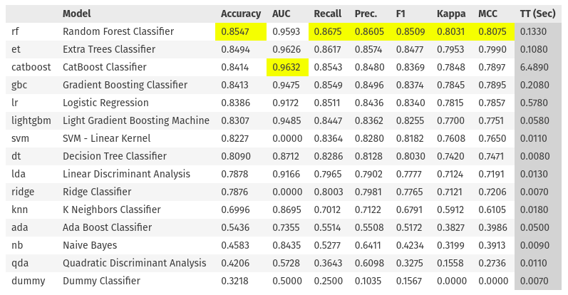

# Mental Health Prediction from Survey Data

## Introduction
In today’s new normal, the screen time of people has increased manifold, which, in some
cases, leads to anxiety and depression. Not just this, the increasing pressure of being on the top of the rat race in which we all are trapped can cause a harmful effect on our mental health. 
We wanted to build a solution to this problem, so we built a Machine Learning based system that predicts the current mental health of a person according to his/her inputs to a set of personality-based questions. We aim to provide psychological assistance to users by assessing their mental stability and which can be further used to connect the user with a medical practitioner/counselor according to the need.

## Data
We collected data from Kaggle as well as from a google form survey created by us. The data contains the responses of the survey filled by the participants. The Kaggle data contained 36 columns and 207 rows with four unique target classes - “Stress”, “Anxiety”, “Depression” and “Panic attack”.

We conducted a survey of our own with the same questions as the Kaggle data. We collected 90 responses from the survey. The survey data contained 36 columns and 90 rows with an added target class - “None”.

#### Data Preprocessing
Data Preprocessing included the following steps:
1. Merging the two datasets.
2. Deal with missing values.
3. Label Encoding the categorical columns.
4. Reduce the number of target classes by merging "anxiety" and "stress" into one class.
5. Handle class imbalance by oversampling the minority classes.

We now have a dataset which can be used for training the model.

## Model
We used PyCaret to train the model. 
PyCaret is an open-source, low-code machine learning library in Python that allows you to go from preparing your data to deploying your model within minutes in your choice of notebook environment.
Using PyCaret, we trained a model using 14 different algorithms and compared their performance. We selected the Random Forest Classifier as our final model which gave us the following metrics:

| Metric | Value |
| ------ | ----- |
| Accuracy | 0.8758 |
| AUC | 0.9787 |
| Recall | 0.8752 |
| Precision | 0.8739 |
| F1 | 0.8711 |

We finalized the model and saved it as a pickle file.

## API
Until now, we got an overview of the core development process of the Machine Learning model. But, most of the users will not be able to work at the code level or even want to download the packages needed for running the scripts. They will simply want to use the core functionality of our Model and inspect the results. Therefore, we developed an Application Programming Interface (API) that provides the proper abstraction required for users to interact with the underlying model.
In our case, the interactions involve:
1. The client (Our Android Application, Users, etc.) will send a request
to the server
2. The server (Our API) will take the request and return a response to the client 

I used FastAPI as our framework to build the API service. Here, we use a POST request to send the information collected from the User back to the server. This POST request is going to take input parameters from the user, which, in this case, are the options selected by the User for every question asked.

## Deployment
The API we built can only run on a very specific environment and often fails to run on other machines. To overcome this, I have encapsulated the Application in a very specific environment using Docker.

After packaging, we first git version our source codes to GitHub.

Then we deployed our Application on Render. 
Render is a cloud platform that makes it simple to host your code and applications. Render is built for modern applications and offers everything you need out-of-the-box. We can deploy anything from a simple static site to complex applications in minutes.

<!-- ## Results -->

## Contributors

|                                                                                                                                                                                  |
| :------------------------------------------------------------------------------------------------------------------------------------------------------------------------------------------------------------------------------------------------------------------------------------------------------------------------------------------: |
|                                                                                                                                        **[Indrashis Paul](https://www.linkedin.com/in/indrapaul824/)**                                                                                                                                        |
|  |

|                                                                                                                                                                                  |
| :------------------------------------------------------------------------------------------------------------------------------------------------------------------------------------------------------------------------------------------------------------------------------------------------------------------------------------------: |
|                                                                                                                                        **[Raghav Agarwal](https://www.linkedin.com/in/raghav-a-30b020102/)**                                                                                                                                        |
|  |
